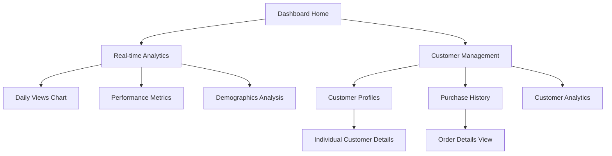

# Marketplace Dashboard Enhancement - Product Requirements Document

## 1. Product Overview

This enhancement focuses on transforming the existing marketplace dashboard into a comprehensive, real-time analytics and customer management platform. The project addresses two critical gaps: replacing mock data with live analytics that respond to actual user interactions, and introducing a complete customer management system that allows sellers to track their customers' purchase history and engagement patterns.

The enhanced dashboard will provide sellers with actionable insights through real-time data visualization and comprehensive customer relationship management tools, ultimately improving business decision-making and customer service capabilities.

## 2. Core Features

### 2.1 User Roles

| Role | Registration Method | Core Permissions |
|------|---------------------|------------------|
| Marketplace Seller | Existing seller account | Can view real-time analytics, manage customer data, access purchase history |
| Platform Admin | Admin invitation | Can view all seller analytics, manage platform-wide customer data |

### 2.2 Feature Module

Our marketplace dashboard enhancement consists of the following main sections:

1. **Real-time Analytics Dashboard**: Live data visualization, performance metrics, trend analysis
2. **Customer Management Center**: Customer profiles, purchase history, contact management
3. **Enhanced Product Analytics**: Real-time product performance, engagement tracking
4. **Live Reporting System**: Dynamic charts, real-time updates, data export capabilities

### 2.3 Page Details

| Page Name | Module Name | Feature description |
|-----------|-------------|---------------------|
| Analytics Dashboard | Daily Views Trend Chart | Display real-time daily view counts with live updates, interactive tooltips showing exact metrics, responsive design for mobile devices |
| Analytics Dashboard | Top Performing Products | Show live product rankings based on views, orders, and revenue with automatic refresh every 30 seconds |
| Analytics Dashboard | Weekly Performance Metrics | Present real-time weekly data including views, likes, orders, and revenue with trend indicators |
| Analytics Dashboard | Engagement Metrics | Track live user interactions including likes, messages, reviews, and shares with real-time counters |
| Analytics Dashboard | Traffic Sources Analysis | Monitor real-time referrer data showing where customers discover products with live percentage calculations |
| Analytics Dashboard | Age Demographics Chart | Display live customer age distribution with dynamic percentage updates and visual representations |
| Analytics Dashboard | Geographic Analytics | Show real-time customer location data with interactive maps and live visitor counts |
| Customer Management | Customer Profiles | Create and manage detailed customer profiles including contact information, purchase history, and preferences |
| Customer Management | Purchase History Tracking | Track all customer transactions with product details, payment information, and order status |
| Customer Management | Customer Analytics | Calculate customer lifetime value, order frequency, and engagement metrics with real-time updates |
| Customer Management | Communication Center | Manage customer communications, support tickets, and interaction history |
| Real-time Updates | Live Data Synchronization | Implement Supabase real-time subscriptions for instant data updates across all dashboard components |
| Real-time Updates | Notification System | Provide live notifications for new orders, customer interactions, and important metrics changes |

## 3. Core Process

**Seller Analytics Flow:**
1. Seller logs into dashboard and views real-time analytics overview
2. Selects specific time ranges and product filters for detailed analysis
3. Monitors live performance metrics and receives instant updates
4. Accesses customer management section to view buyer information
5. Reviews individual customer purchase history and engagement data
6. Exports reports and analytics data for external analysis

**Customer Data Management Flow:**
1. System automatically captures customer data from marketplace transactions
2. Real-time updates populate customer profiles with purchase information
3. Seller accesses customer management center to view buyer details
4. Reviews customer purchase history and product preferences
5. Manages customer communications and support interactions
6. Analyzes customer lifetime value and engagement patterns

## 4. User Interface Design

### 4.1 Design Style

- **Primary Colors**: Blue (#3B82F6) for analytics, Green (#10B981) for positive metrics, Red (#EF4444) for alerts
- **Secondary Colors**: Gray (#6B7280) for text, White (#FFFFFF) for backgrounds, Dark (#1F2937) for dark mode
- **Button Style**: Rounded corners (8px radius), subtle shadows, hover animations with color transitions
- **Font**: Inter font family, 14px base size for body text, 16px for headings, 12px for captions
- **Layout Style**: Card-based design with clean spacing, responsive grid system, top navigation with sidebar
- **Icons**: Lucide React icons for consistency, 16px standard size, 20px for headers

### 4.2 Page Design Overview

| Page Name | Module Name | UI Elements |
|-----------|-------------|-------------|
| Analytics Dashboard | Real-time Charts | Interactive line charts with blue (#3B82F6) primary color, hover tooltips, responsive grid layout, live update indicators |
| Analytics Dashboard | Performance Cards | Clean white cards with colored icons, large metric numbers in 24px font, trend arrows with green/red indicators |
| Analytics Dashboard | Demographics Visualization | Pie charts with distinct color palette, percentage labels, interactive legends, mobile-responsive design |
| Customer Management | Customer List | Table layout with alternating row colors, search functionality, pagination controls, action buttons in primary blue |
| Customer Management | Customer Profile | Split-screen layout with customer info on left, purchase history on right, tabbed interface for different data sections |
| Customer Management | Purchase History | Timeline-style layout with order cards, product thumbnails, status badges with appropriate colors |

### 4.3 Responsiveness

The enhanced dashboard is designed with a mobile-first approach, featuring responsive breakpoints at 768px (tablet) and 1024px (desktop). Touch interaction optimization includes larger tap targets (44px minimum), swipe gestures for chart navigation, and collapsible sidebar navigation for mobile devices. All charts and data visualizations automatically adapt to screen size while maintaining readability and functionality.