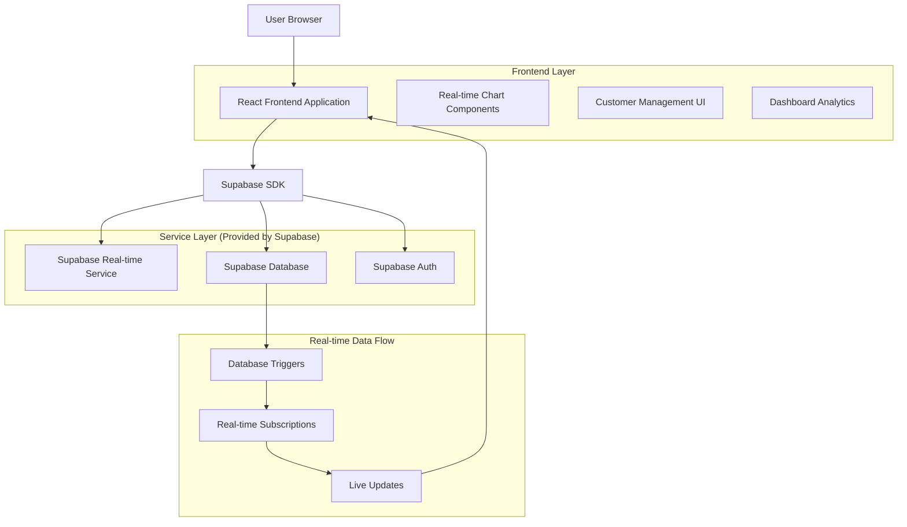
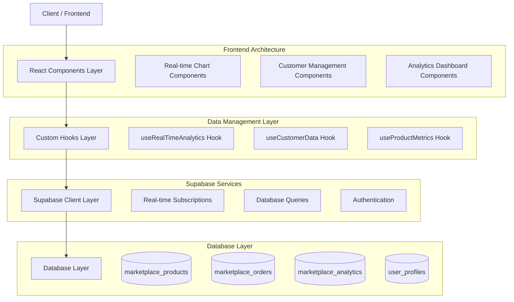
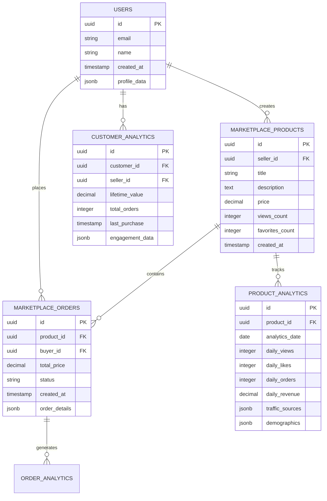

# Marketplace Dashboard Enhancement - Technical Architecture Document

## 1. Architecture Design



## 2. Technology Description

- Frontend: React@18 + TypeScript + Tailwind CSS@3 + Vite + Recharts (for enhanced charts)
- Backend: Supabase (PostgreSQL database, real-time subscriptions, authentication)
- Real-time: Supabase Real-time subscriptions for live data updates
- Charts: Recharts library for interactive and responsive data visualization
- State Management: React hooks with custom real-time data hooks

## 3. Route Definitions

| Route | Purpose |
|-------|---------|
| /marketplace/dashboard | Enhanced seller dashboard with real-time analytics and customer management |
| /marketplace/dashboard/analytics | Detailed analytics view with interactive charts and filters |
| /marketplace/dashboard/customers | Customer management center with profiles and purchase history |
| /marketplace/dashboard/customers/[id] | Individual customer detail page with complete interaction history |
| /marketplace/dashboard/reports | Export and reporting functionality for analytics data |

## 4. API Definitions

### 4.1 Real-time Analytics API

**Get Real-time Product Analytics**
```
GET /api/marketplace/analytics/real-time
```

Request:
| Param Name | Param Type | isRequired | Description |
|------------|------------|------------|-------------|
| sellerId | string | true | The seller's user ID |
| productId | string | false | Specific product ID (optional for all products) |
| timeRange | string | true | Time range: '7d', '30d', '90d', '1y' |
| metrics | string[] | false | Specific metrics to fetch |

Response:
| Param Name | Param Type | Description |
|------------|------------|-------------|
| dailyViews | object[] | Array of daily view counts with dates |
| weeklyPerformance | object[] | Weekly metrics including views, orders, revenue |
| topProducts | object[] | Top performing products with real metrics |
| engagementMetrics | object | Likes, messages, reviews, shares counts |
| trafficSources | object[] | Referrer data with counts and percentages |
| demographics | object | Age groups and location data |

Example Response:
```json
{
  "dailyViews": [
    { "date": "2024-01-01", "views": 145, "uniqueViews": 98 },
    { "date": "2024-01-02", "views": 167, "uniqueViews": 112 }
  ],
  "weeklyPerformance": [
    {
      "week": "2024-W01",
      "views": 1250,
      "likes": 89,
      "orders": 23,
      "revenue": 1450.50
    }
  ],
  "topProducts": [
    {
      "productId": "prod_123",
      "title": "Eco-Friendly Water Bottle",
      "views": 456,
      "orders": 12,
      "revenue": 240.00,
      "conversionRate": 2.63
    }
  ]
}
```

**Get Customer Analytics**
```
GET /api/marketplace/customers/analytics
```

Request:
| Param Name | Param Type | isRequired | Description |
|------------|------------|------------|-------------|
| sellerId | string | true | The seller's user ID |
| customerId | string | false | Specific customer ID (optional) |
| includeHistory | boolean | false | Include purchase history details |

Response:
| Param Name | Param Type | Description |
|------------|------------|-------------|
| customers | object[] | Customer profiles with analytics |
| totalCustomers | number | Total unique customers |
| averageOrderValue | number | Average order value across customers |
| customerLifetimeValue | number | Average customer lifetime value |

### 4.2 Customer Management API

**Get Customer Details**
```
GET /api/marketplace/customers/[customerId]
```

Request:
| Param Name | Param Type | isRequired | Description |
|------------|------------|------------|-------------|
| customerId | string | true | The customer's user ID |
| sellerId | string | true | The seller's user ID for authorization |

Response:
| Param Name | Param Type | Description |
|------------|------------|-------------|
| profile | object | Customer profile information |
| purchaseHistory | object[] | Complete order history |
| analytics | object | Customer-specific metrics |
| communications | object[] | Message and support history |

## 5. Server Architecture Diagram



## 6. Data Model

### 6.1 Data Model Definition



### 6.2 Data Definition Language

**Enhanced Product Analytics Table**
```sql
-- Create enhanced product analytics table
CREATE TABLE product_analytics (
    id UUID PRIMARY KEY DEFAULT gen_random_uuid(),
    product_id UUID REFERENCES marketplace_products(id) ON DELETE CASCADE,
    analytics_date DATE NOT NULL,
    daily_views INTEGER DEFAULT 0,
    daily_unique_views INTEGER DEFAULT 0,
    daily_likes INTEGER DEFAULT 0,
    daily_messages INTEGER DEFAULT 0,
    daily_orders INTEGER DEFAULT 0,
    daily_revenue DECIMAL(10,2) DEFAULT 0,
    traffic_sources JSONB DEFAULT '{}',
    demographics JSONB DEFAULT '{}',
    created_at TIMESTAMP WITH TIME ZONE DEFAULT NOW(),
    updated_at TIMESTAMP WITH TIME ZONE DEFAULT NOW()
);

-- Create customer analytics table
CREATE TABLE customer_analytics (
    id UUID PRIMARY KEY DEFAULT gen_random_uuid(),
    customer_id UUID REFERENCES auth.users(id) ON DELETE CASCADE,
    seller_id UUID REFERENCES auth.users(id) ON DELETE CASCADE,
    lifetime_value DECIMAL(10,2) DEFAULT 0,
    total_orders INTEGER DEFAULT 0,
    average_order_value DECIMAL(10,2) DEFAULT 0,
    last_purchase_date TIMESTAMP WITH TIME ZONE,
    first_purchase_date TIMESTAMP WITH TIME ZONE,
    engagement_score INTEGER DEFAULT 0,
    preferred_categories JSONB DEFAULT '[]',
    created_at TIMESTAMP WITH TIME ZONE DEFAULT NOW(),
    updated_at TIMESTAMP WITH TIME ZONE DEFAULT NOW()
);

-- Create real-time view tracking table
CREATE TABLE product_view_logs (
    id UUID PRIMARY KEY DEFAULT gen_random_uuid(),
    product_id UUID REFERENCES marketplace_products(id) ON DELETE CASCADE,
    viewer_id UUID REFERENCES auth.users(id) ON DELETE SET NULL,
    session_id TEXT,
    referrer_source TEXT,
    user_agent TEXT,
    ip_address INET,
    view_duration INTEGER, -- in seconds
    created_at TIMESTAMP WITH TIME ZONE DEFAULT NOW()
);

-- Create indexes for performance
CREATE INDEX idx_product_analytics_product_date ON product_analytics(product_id, analytics_date DESC);
CREATE INDEX idx_product_analytics_date ON product_analytics(analytics_date DESC);
CREATE INDEX idx_customer_analytics_seller ON customer_analytics(seller_id);
CREATE INDEX idx_customer_analytics_customer ON customer_analytics(customer_id);
CREATE INDEX idx_product_view_logs_product ON product_view_logs(product_id, created_at DESC);
CREATE INDEX idx_product_view_logs_viewer ON product_view_logs(viewer_id, created_at DESC);

-- Create function to update analytics in real-time
CREATE OR REPLACE FUNCTION update_product_analytics()
RETURNS TRIGGER AS $$
BEGIN
    -- Update daily analytics when new view is logged
    IF TG_TABLE_NAME = 'product_view_logs' THEN
        INSERT INTO product_analytics (product_id, analytics_date, daily_views, daily_unique_views)
        VALUES (NEW.product_id, CURRENT_DATE, 1, 1)
        ON CONFLICT (product_id, analytics_date)
        DO UPDATE SET
            daily_views = product_analytics.daily_views + 1,
            daily_unique_views = CASE 
                WHEN NEW.viewer_id IS NOT NULL THEN product_analytics.daily_unique_views + 1
                ELSE product_analytics.daily_unique_views
            END,
            updated_at = NOW();
    END IF;
    
    -- Update customer analytics when new order is created
    IF TG_TABLE_NAME = 'marketplace_orders' THEN
        INSERT INTO customer_analytics (customer_id, seller_id, lifetime_value, total_orders, average_order_value, last_purchase_date, first_purchase_date)
        SELECT 
            NEW.buyer_id,
            p.seller_id,
            NEW.total_price,
            1,
            NEW.total_price,
            NEW.created_at,
            NEW.created_at
        FROM marketplace_products p
        WHERE p.id = NEW.product_id
        ON CONFLICT (customer_id, seller_id)
        DO UPDATE SET
            lifetime_value = customer_analytics.lifetime_value + NEW.total_price,
            total_orders = customer_analytics.total_orders + 1,
            average_order_value = (customer_analytics.lifetime_value + NEW.total_price) / (customer_analytics.total_orders + 1),
            last_purchase_date = NEW.created_at,
            updated_at = NOW();
    END IF;
    
    RETURN NEW;
END;
$$ LANGUAGE plpgsql;

-- Create triggers for real-time updates
CREATE TRIGGER trigger_update_view_analytics
    AFTER INSERT ON product_view_logs
    FOR EACH ROW EXECUTE FUNCTION update_product_analytics();

CREATE TRIGGER trigger_update_order_analytics
    AFTER INSERT ON marketplace_orders
    FOR EACH ROW EXECUTE FUNCTION update_product_analytics();

-- Grant permissions for real-time subscriptions
GRANT SELECT ON product_analytics TO authenticated;
GRANT SELECT ON customer_analytics TO authenticated;
GRANT INSERT ON product_view_logs TO authenticated;
GRANT ALL PRIVILEGES ON product_analytics TO authenticated;
GRANT ALL PRIVILEGES ON customer_analytics TO authenticated;

-- Enable real-time for tables
ALTER PUBLICATION supabase_realtime ADD TABLE product_analytics;
ALTER PUBLICATION supabase_realtime ADD TABLE customer_analytics;
ALTER PUBLICATION supabase_realtime ADD TABLE marketplace_orders;
```